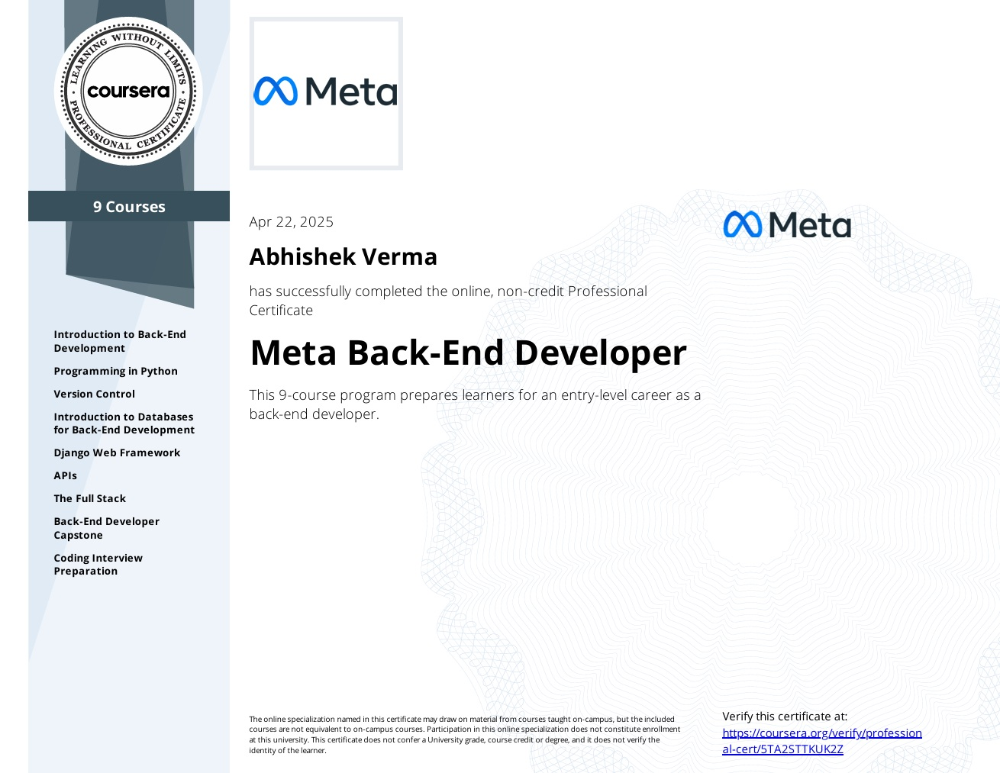
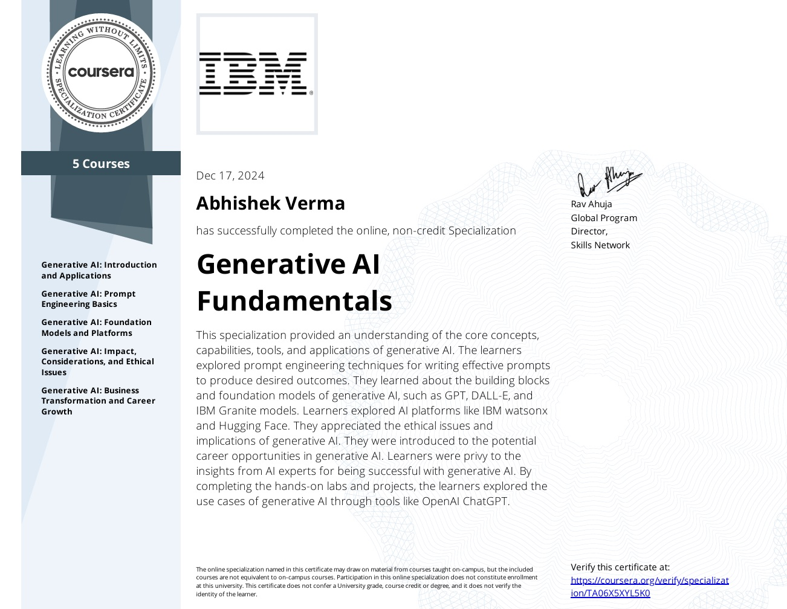
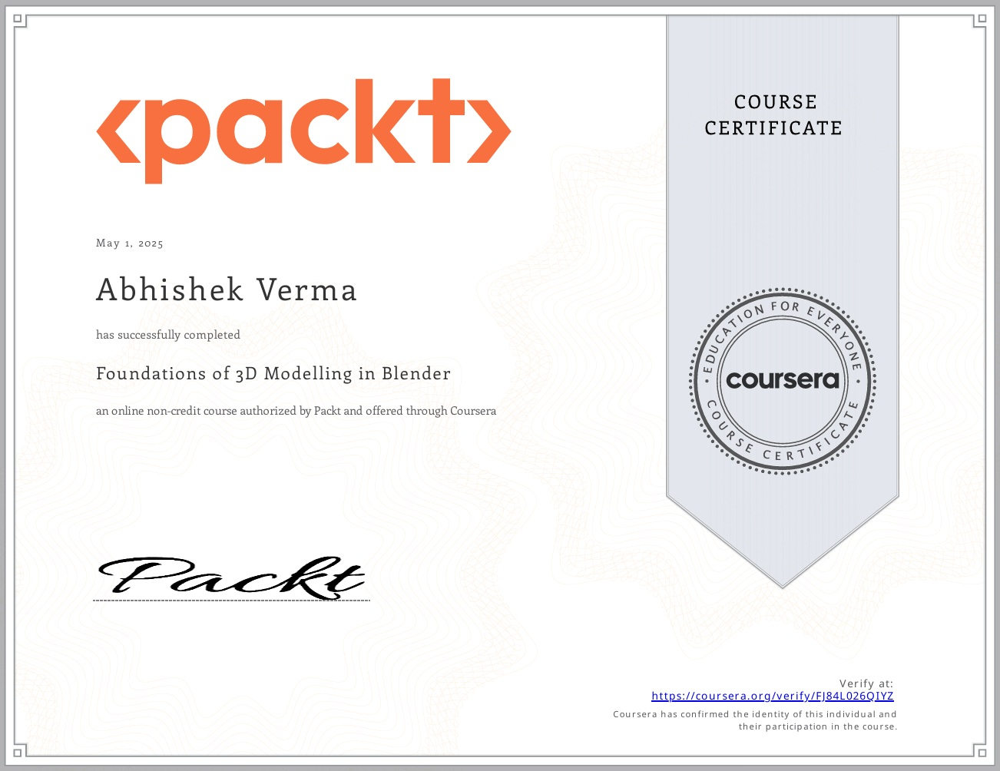
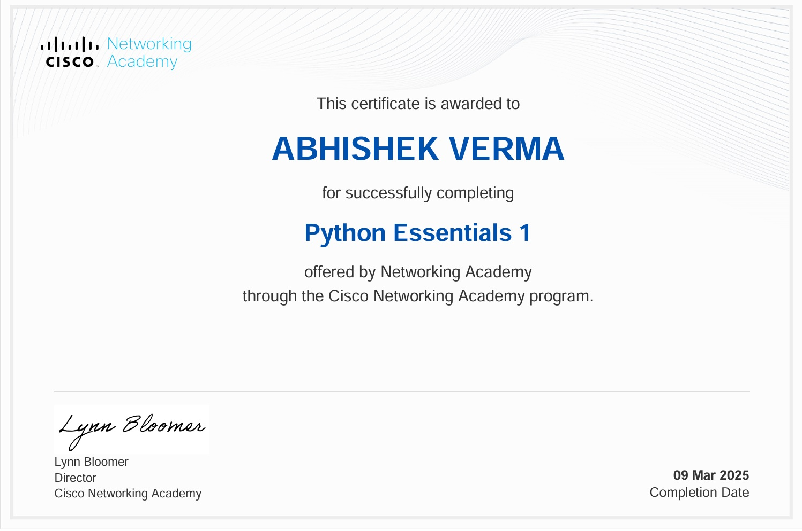
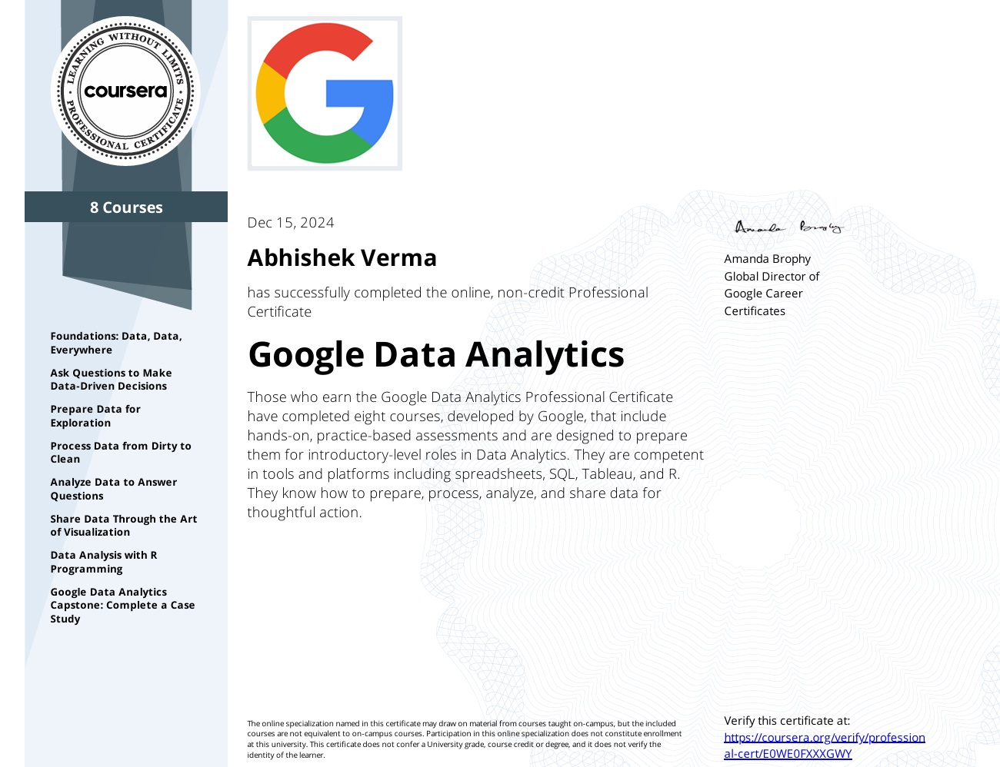

<h1 align="center">Hi 👋, I'm Abhishek Verma</h1>
<h3 align="center">An Ai enthusiast & Full Stack Developer passionate about building intelligent systems and tools includes scalable web apps, enterprise desktop apps and Ai-driven solutions.</h3>

| Microsoft Python | Meta backend | Meta FrontEnd | Generative Ai 
|                   |-----------|-----------|-----------|
|  |  |  |  |
|------------|-----------|-----------|-----------|
 Syhnthetic Data using Blender | Google Project Management | Cisco Python | Data Analytics |
|------------|-----------|-----------|-----------|
|  |  |   |  |

---

🔭 I’m currently working on:
- Deep Learning, Computer Vision & Synthetic Data Generation
- Full Stack Development with Django + React + Api
- Custom Enterprise Desktop Applications Tools using Qt and python frameworks
- Building Smart Tools for Real-World Use Cases

🌱 I’m currently learning:
- Generative AI & LLMs
- Advanced 3D workflows with Blender
- Scalable API Design

---

### 🤝 Connect with me:

  
  
  
  

---

### 🛠️ Languages & Tools:

  
  
  
  
  
  
  
  
  
  
  
  
  
  
  
  
  
  
  

---

  <em>“Code is like humor. When you have to explain it, it’s bad.”</em>

