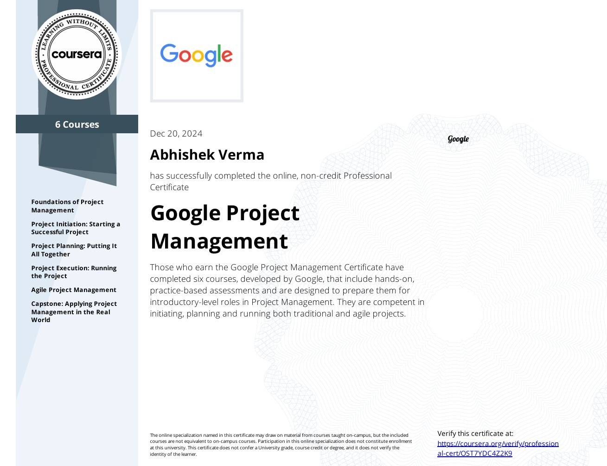

<!-- GitHub Profile README -->

<h1 align="center">Hi 👋, I'm Abhishek Verma</h1>

  

<h3 align="center">An Ai enthusiast & Full Stack Developer passionate about building intelligent systems and tools includes scalable web apps, enterprise desktop apps and Ai-driven solutions.</h3>

---

### 🧠 Projects & Certificates

| Microsoft Python | Meta Backend | Meta FrontEnd | Generative AI |
|:----------------:|:------------:|:-------------:|:-------------:|
|  |  |  |  |

| Synthetic Data (Blender) | Google PM | Cisco Python | Data Analytics |
|:------------------------:|:---------:|:------------:|:--------------:|
|  |  |  |  |

---

### 🚀 What I'm Working On

- 🤖 Deep Learning, Computer Vision & Synthetic Data Generation
- 🧱 Full Stack Development (Django + React + REST APIs)
- 🖥️ Custom Enterprise Desktop Applications Tools using Qt and python frameworks
- 🛠️ Building Smart Tools for Real-World Use Cases

---

### 📚 Currently Exploring

- 🧠 Generative AI & LLMs
- 🎨 Blender for 3D and synthetic dataset generation
- 🌐 Scalable API & Microservices Design

---

### 🔗 Connect With Me

---

### 🛠️ Tech Stack

  
  
  
  
  
  
  
  
  
  
  
  
  
  
  
  
  
  

---

  <em>"Here are some of my innovative concepts & Projects"</em>

